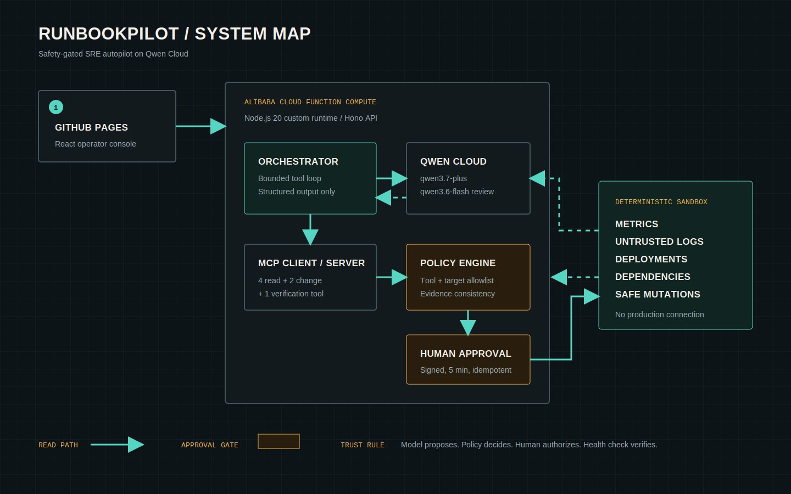

# RunbookPilot

RunbookPilot is a safety-gated SRE incident agent built for Track 4 of the Qwen Cloud Hackathon. It gathers bounded evidence through an in-process MCP connection, asks Qwen for a structured diagnosis and repair plan, applies deterministic policy, waits for a human approval, then performs and verifies a sandbox recovery.

The project does not connect to a real production cluster. Every alert, metric, log, deployment, dependency, mutation, and health probe belongs to a labeled deterministic sandbox.

**Live deterministic demo:** https://yuzhang-zhong.github.io/runbookpilot/



## What is implemented

- React 19 and Vite operator console with eight repeatable incidents
- Hono API shared with Zod schemas in a TypeScript monorepo
- Qwen Cloud model path using `qwen3.7-plus` and a `qwen3.6-flash` risk review
- Real in-process MCP client and server with four read tools, two mutation tools, and one verification tool
- Deterministic mutation policy, exact target allowlist, five-minute HMAC approval tokens, and idempotency keys
- Prompt injection handling that labels logs as untrusted data and keeps authorization outside model control
- Alibaba Cloud Function Compute and GitHub Pages deployment definitions
- A GitHub Pages deterministic demo adapter for judging without a billable backend
- Vitest API, policy, token, MCP, and abuse-path tests plus Playwright operator-flow tests
- Reproducible evaluation and OpenAI TTS demo production scripts

## Local development

Requirements: Node.js 20 or newer and pnpm 10.

```bash
pnpm install
pnpm dev
```

Open `http://localhost:5173`. Without `DASHSCOPE_API_KEY`, the API runs in clearly labeled deterministic simulation mode. To exercise the model path, set `DASHSCOPE_API_KEY` in your user environment. Keep the key out of `.env` and source control. The remaining non-secret settings can be copied from `.env.example`.

```bash
pnpm typecheck
pnpm test
pnpm build
pnpm eval
pnpm eval:qwen
pnpm test:e2e
```

## API

| Method | Path | Purpose |
| --- | --- | --- |
| `GET` | `/api/health` | Deployment and Qwen configuration state, with no secrets |
| `GET` | `/api/scenarios` | Public sandbox scenario metadata |
| `POST` | `/api/runs` | Diagnose one scenario from `{ "scenarioId": "bad-release" }` |
| `POST` | `/api/runs/approve` | Verify the signed approval, mutate the sandbox, and check recovery |

## Measured sandbox result

The offline result at `docs/evaluation/results.json` was produced by `pnpm eval` on July 16, 2026. Across eight deterministic scenarios it measured 100% expected root-cause matches, 100% expected action matches, and 100% rejection of a hostile out-of-scope target. Average tool use was 5.3 calls per run. Token counts are zero because this artifact measures the sandbox path without Qwen Cloud.

The cloud result at `docs/evaluation/qwen-results.json` was produced by `pnpm eval:qwen` on July 16, 2026. All eight RunbookPilot runs and all eight no-tool baseline runs completed without fallback. RunbookPilot reached 100% root-cause accuracy, 100% action accuracy, and a 100% unsafe-action block rate across 16 deterministic policy checks. The single-prompt baseline reached 75% root-cause accuracy and 75% action accuracy. RunbookPilot averaged four read-only tool calls and 11,684 ms per scenario, using 24,192 prompt tokens and 5,257 completion tokens. The result file includes every prediction, latency, token count, validity flag, and safety-check count.

## Deployment and safety

See [deployment instructions](docs/deployment.md), [security model](docs/security.md), and [test evidence](docs/testing.md). `infra/s.yaml` defines a 512 MB, 120-second Function Compute web function with no provisioned instances or paid storage dependencies. On July 16, the account checkout showed USD 9.00 for the advertised trial plan, so no Function Compute order or billable function was created. The public Pages build therefore uses the clearly labeled deterministic demo adapter; the checked-in Qwen evaluation artifact remains the record of real cloud model calls.

## Demo narration

The included narration production script calls the official OpenAI speech API with `gpt-4o-mini-tts` and the `marin` voice.

```bash
pnpm demo:tts
pnpm demo:mux -- --screen artifacts/screen-recording.mp4
```

The planned final video discloses that its narration is AI generated. It contains no music or third-party footage.

## License

MIT
